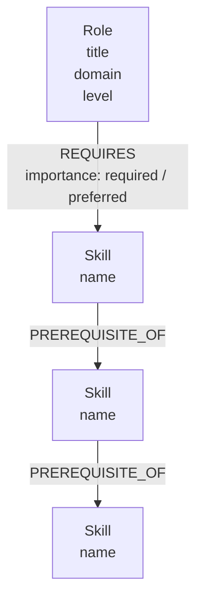
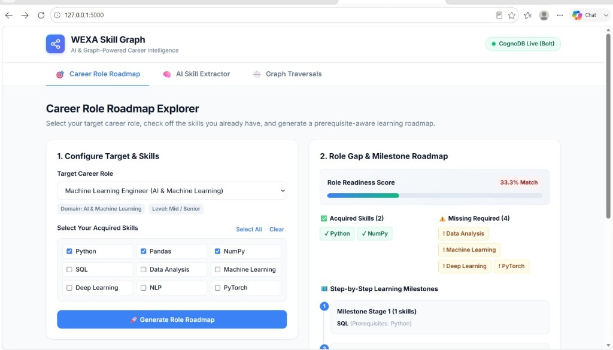
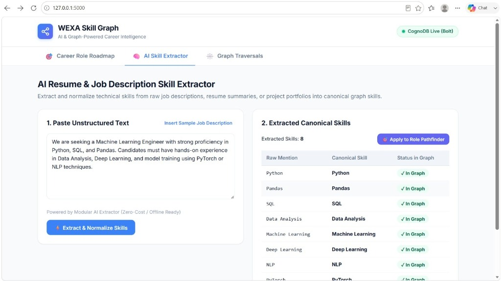
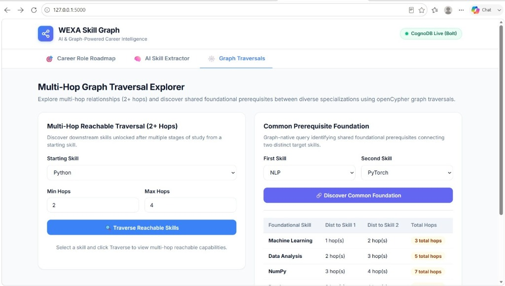

# WEXA Skill Graph Application

An AI-powered Skill Graph application for intelligent skill extraction, canonical normalization, multi-hop dependency analysis, career role gap calculation, and dependency-aware learning roadmap generation.

---

## Live Demo

Live application:
https://wexa-skill-graph.onrender.com

---

## 1. Project Overview

The **WEXA Skill Graph Application** is designed to address a fundamental challenge in technical career development and talent matching: navigating complex skill dependencies. In traditional systems, skills are represented as flat, disconnected keyword tags. However, real-world competencies form an interconnected dependency graph where foundational skills unlock intermediate capabilities, and multi-skill combinations are required for specialized career roles.

This platform provides:
1. **Interactive Career Role Roadmaps**: Evaluates user competencies against target career roles (e.g. *Data Scientist*, *Machine Learning Engineer*, *NLP Engineer*, *Data Analyst*), calculates readiness percentages, and constructs milestone-based learning roadmaps following strict prerequisite dependency order.
2. **AI/NLP Skill Extraction & Normalization**: Ingests raw unstructured text (job descriptions or resume summaries), extracts technical skills using a modular provider interface, and normalizes colloquial surface forms (`"python3"`, `"pandas lib"`, `"ml"`) into canonical graph nodes.
3. **Multi-Hop Graph Traversals**: Performs deep dependency traversals (2+ relationship hops) to uncover downstream capabilities and identifies shared foundational prerequisites across diverse specializations using **CognoDB** and **openCypher**.
4. **User-Friendly Web Application**: Serves a clean, responsive single-page web interface with real-time database connectivity indicators, loading spinners, empty states, and error alerts.

---

## 2. Why a Graph Database?

A skill ecosystem is inherently a **Directed Acyclic Graph (DAG)** of prerequisites and role requirements. While relational databases (RDBMS) can store foreign keys, traversing variable-depth relationships becomes computationally expensive and syntactically awkward.

### Comparison: Graph Database vs. Relational Database

| Feature / Traversal Dimension | Relational Database (SQL) | Graph Database (CognoDB & openCypher) |
|---|---|---|
| **Multi-Hop Traversal (2+ Hops)** | Requires cascading `JOIN` operations or recursive Common Table Expressions (`WITH RECURSIVE`). | Expressed as a single pattern: `(s)-[:PREREQUISITE_OF*2..4]->(t)`. |
| **Traversal Performance** | Exponential degradation $O(k^d)$ with traversal depth $d$ due to index lookups and join scans. | **Index-Free Adjacency**: Traverses direct memory/disk pointer hops in $O(1)$ per edge. |
| **Shared Prerequisite Discovery** | Requires intersecting multiple recursive CTE result sets with cycle guards and complex aggregations. | Single declarative openCypher query using path pattern matching. |
| **Schema Evolution** | Rigid table structures requiring schema migrations for new relationship metadata. | Flexible property graph model allowing arbitrary properties on nodes and edges without schema locks. |

---

## 3. Graph Data Model

The graph database models skills, prerequisite dependencies, career roles, and requirements using labeled nodes, typed directed relationships, and rich properties.



### Node Labels & Properties
- `(:Skill)`: Represents an individual skill or technical domain competency.
  - `name` (*String, Unique*): Canonical name of the skill (e.g. `"Python"`, `"Pandas"`, `"SQL"`, `"Data Analysis"`).
- `(:Role)`: Represents a target career role.
  - `title` (*String, Unique*): Title of the career role (e.g. `"Data Scientist"`, `"Machine Learning Engineer"`).
  - `domain` (*String*): Industry specialization (e.g. `"AI & Machine Learning"`, `"Data Analytics"`).
  - `level` (*String*): Career tier (e.g. `"Entry / Mid"`, `"Senior"`).

### Relationship Types & Properties
- `[:PREREQUISITE_OF]`: Directed edge indicating that source skill is a prerequisite for target skill.
  - Pattern: `(from_skill:Skill)-[:PREREQUISITE_OF]->(to_skill:Skill)`
  - Example: `(:Skill {name: "Python"})-[:PREREQUISITE_OF]->(:Skill {name: "Pandas"})`
- `[:REQUIRES]`: Directed edge indicating that a career role requires or prefers a skill.
  - Pattern: `(role:Role)-[:REQUIRES {importance: 'required' | 'preferred'}]->(skill:Skill)`
  - Property `importance` (*String*): Either `"required"` or `"preferred"`.

---

## 4. Technology Stack

- **Backend Framework**: Python 3.10+, Flask 3.0+
- **Graph Database**: CognoDB
- **Graph Driver & Protocol**: Official Neo4j Python Driver (`neo4j>=5.0.0`) over the binary **Bolt Protocol** (`bolt://`)
- **Query Language**: openCypher
- **NLP & Normalization**: Built-in deterministic regex word-boundary tokenizer & modular LLM adapter interface
- **Frontend**: Vanilla HTML5, CSS3 (Custom Responsive Design System with CSS variables), Modern JavaScript (`fetch` API)
- **Production WSGI Server**: Gunicorn 21.2+
- **Automated Testing**: Pytest 8.0+ (78 unit, integration, and live database tests)

---

## 5. Project Structure

```
Graph database - skillpath/
├── backend/
│   ├── __init__.py
│   ├── app.py                     # Flask application factory (create_app)
│   ├── config.py                  # Configuration loader via python-dotenv
│   ├── graph/
│   │   ├── __init__.py            # Graph package exports
│   │   ├── cognodb_client.py      # Official Neo4j/Bolt driver client for CognoDB
│   │   ├── queries.py             # Centralized parameterized openCypher queries
│   │   ├── sample_data.py         # Sample skill relationships & career roles
│   │   ├── seed.py                # Idempotent database seed script
│   │   └── skill_graph.py         # In-memory graph & Kahn DAG topological sorter
│   ├── routes/
│   │   ├── __init__.py
│   │   ├── health.py              # Health check routes (/api/health, /api/health/db)
│   │   └── skills.py              # Skill discovery, traversals, NLP, & role endpoints
│   ├── services/
│   │   ├── __init__.py
│   │   ├── graph_traversal.py     # Multi-hop, pathfinding, & common prerequisite service
│   │   ├── role_recommendations.py# Role gap analysis & DAG roadmap generator
│   │   ├── skill_gap.py           # Skill gap calculation & shortest pathfinder
│   │   └── nlp/                   # AI/NLP Extraction & Normalization
│   │       ├── __init__.py
│   │       ├── base.py            # BaseSkillExtractor abstract interface
│   │       ├── factory.py         # Extractor factory
│   │       ├── llm_extractor.py   # Modular LLM adapter with fallback
│   │       ├── normalizer.py      # Canonical taxonomy skill normalizer
│   │       └── rule_extractor.py  # Regex & token pattern extractor
│   ├── static/
│   │   ├── css/
│   │   │   └── style.css          # Responsive design system & animations
│   │   └── js/
│   │       └── app.js             # SPA logic & API communication
│   └── templates/
│       └── index.html             # User-facing web application interface
├── docs/
│   ├── architecture.md            # Comprehensive system architecture document
│   └── project-notes.md           # Implementation status and milestone log
├── tests/
│   ├── __init__.py
│   ├── conftest.py                # Pytest fixtures and Flask test client
│   ├── test_api_extractor.py      # Extraction & normalization API tests
│   ├── test_api_roles.py          # Career role recommendation API tests
│   ├── test_api_skills.py         # Skills REST API integration tests
│   ├── test_api_traversal.py      # Graph traversal API tests
│   ├── test_cognodb.py            # CognoDB client, openCypher, & error tests
│   ├── test_frontend.py           # Frontend route integration test
│   ├── test_graph.py              # In-memory graph unit tests
│   ├── test_health.py             # Health check automated tests
│   ├── test_nlp_extractor.py      # NLP extraction & normalizer unit tests
│   ├── test_roles.py              # Career role & DAG roadmap unit tests
│   ├── test_skill_gap.py          # Skill gap service unit tests
│   └── test_traversal.py          # Multi-hop and graph query unit tests
├── .env.example                   # Template environment variables
├── .gitignore                     # Git ignore rules
├── Procfile                       # Production process definition
├── README.md                      # Complete project documentation
├── requirements.txt               # Project dependencies
└── wsgi.py                        # Production WSGI entrypoint
```

---

## 6. Local Setup Instructions

### Prerequisites
- Python 3.10 or higher
- `pip` (Python package manager)
- Active CognoDB instance (or local Bolt-compatible endpoint)

### Step 1: Clone and Set Up Virtual Environment

```bash
# Windows (PowerShell)
python -m venv .venv
.venv\Scripts\Activate.ps1

# Linux / macOS
python3 -m venv .venv
source .venv/bin/activate
```

### Step 2: Install Dependencies

```bash
pip install -r requirements.txt
```

### Step 3: Configure Environment Variables

Copy the template file:
```bash
cp .env.example .env
```

Configure your `.env` with your CognoDB credentials:
```ini
# Flask Configuration
FLASK_APP=backend.app:create_app
FLASK_ENV=development
FLASK_DEBUG=1
PORT=5000
HOST=127.0.0.1
SECRET_KEY=development-secret-key

# CognoDB Graph Database (Bolt Protocol)
COGNODB_URI=bolt://<your-cognodb-host>:7687
COGNODB_USERNAME=cognodb
COGNODB_PASSWORD=<your_cognodb_password>
COGNODB_DATABASE=cognodb

# AI / NLP Provider Configuration (Optional)
AI_PROVIDER=rule_based
```

### CognoDB Cloud Instance Setup

To create and configure a free CognoDB Cloud database instance:
1. Create an account or sign into **CognoDB Cloud**.
2. Create a free `c0` instance.
3. Select your preferred hosting region.
4. Wait for instance provisioning to complete.
5. Copy and save the generated **Bolt connection URI**.
6. Securely save the generated `cognodb` username and password.
7. Place these values into your local `.env` configuration file:

```ini
COGNODB_URI=bolt+s://<your-instance-id>.databases.cognodb.cloud
COGNODB_USERNAME=cognodb
COGNODB_PASSWORD=<your-password>
COGNODB_DATABASE=cognodb
```

*(Note: Never commit `.env` or expose real credentials).*

---

## 7. Seeding the CognoDB Database

To populate your CognoDB database with initial skills, prerequisite relationships, and career roles, run the idempotent seed script:

```bash
python -m backend.graph.seed
```

### What Gets Seeded:
- **10 Prerequisite Relationships**:
  - `Python` $\rightarrow$ `Pandas`, `NumPy`, `SQL`
  - `Pandas`, `NumPy`, `SQL` $\rightarrow$ `Data Analysis`
  - `Data Analysis` $\rightarrow$ `Machine Learning`
  - `Machine Learning` $\rightarrow$ `Deep Learning`, `NLP`
  - `Deep Learning` $\rightarrow$ `PyTorch`
- **4 Career Roles**:
  - `Data Analyst` (Domain: Data Analytics, Level: Entry / Mid)
  - `Data Scientist` (Domain: AI & Data Science, Level: Mid)
  - `Machine Learning Engineer` (Domain: AI & Machine Learning, Level: Mid / Senior)
  - `NLP Engineer` (Domain: Natural Language Processing, Level: Senior)
- **24 Role Requirements** (`[:REQUIRES]` edges with importance properties).

*Note: The seed script uses openCypher `MERGE` statements and can be safely executed multiple times without generating duplicate nodes or relationships.*

---

## 8. Running the Application Locally

Start the Flask application:

```bash
python backend/app.py
```

Open your browser and navigate to:
```
http://127.0.0.1:5000
```

---

## 9. Web Application Features & UI Guide

The web UI provides three dedicated workspaces:

### 1. 🎯 Career Role Roadmap Explorer
- **Select Role**: Choose from seeded industry roles (e.g. *Machine Learning Engineer*).
- **Select Acquired Skills**: Check off skills already mastered.
- **Generate Roadmap**: Visualizes your **Readiness Percentage Score**, list of acquired skills, missing required competencies, and a **Milestone Learning Timeline** showing intermediate prerequisites in sequential order.

### 2. 🧠 AI Resume / Job Description Skill Extractor
- **Unstructured Text Processing**: Paste a job description or resume summary (or click *Insert Sample Job Description*).
- **Extraction & Normalization**: Detects skill mentions, case-folds and resolves colloquial aliases, and verifies presence against the graph taxonomy.
- **Direct Handoff**: Click **Apply to Role Pathfinder** to automatically transfer all extracted skills into the roadmap explorer.

### 3. 🕸️ Multi-Hop Graph Traversal Explorer
- **Reachable Skills Traversal (2+ Hops)**: Select a starting skill and configure `min_hops` / `max_hops` to explore unlocked downstream capabilities.
- **Common Prerequisite Foundation**: Select two distinct target skills (e.g. *NLP* and *PyTorch*) to discover shared foundational prerequisite competencies across arbitrary depths.

### 4. 📸 UI Screenshots

#### Career Role Roadmap

*Interactive career role pathfinder displaying readiness score (16.7% match), acquired skills, missing requirements, and a 5-step milestone learning roadmap DAG.*

#### AI Skill Extractor

*AI/NLP skill extraction and normalization interface parsing unstructured job description text into canonical graph skills.*

#### Multi-Hop Graph Traversal

*Multi-hop graph traversal (2-4 hops) and common prerequisite discovery identifying shared foundations between distinct technical domains.*

---

## 10. openCypher Queries Explained

All Cypher queries in `backend/graph/queries.py` are strictly parameterized to ensure safety, prevent injection, and optimize query plan caching.

### 1. Parameterized 2+ Hop Reachable Traversal (`GET_REACHABLE_SKILLS`)
Traverses variable-length directed prerequisite paths from `$start_name` within depth bounds:
```cypher
MATCH p = (s:Skill {name: $start_name})-[:PREREQUISITE_OF*1..10]->(target:Skill)
WHERE length(p) <= $max_hops AND length(p) >= $min_hops
WITH target, min(length(p)) AS distance
RETURN target.name AS skill, distance
ORDER BY distance ASC, skill ASC
```

### 2. Graph-Native Common Prerequisite Foundation (`GET_COMMON_PREREQUISITES`)
Finds shared foundational prerequisite skills connecting two distinct target skills across arbitrary depths:
```cypher
MATCH p1 = (common:Skill)-[:PREREQUISITE_OF*1..10]->(target1:Skill {name: $skill_1}),
      p2 = (common)-[:PREREQUISITE_OF*1..10]->(target2:Skill {name: $skill_2})
WHERE target1 <> target2
WITH common, min(length(p1)) AS dist_to_skill1, min(length(p2)) AS dist_to_skill2
RETURN common.name AS skill,
       dist_to_skill1,
       dist_to_skill2,
       (dist_to_skill1 + dist_to_skill2) AS total_distance
ORDER BY total_distance ASC, skill ASC
```

### 3. Shortest Prerequisite / Learning Path (`GET_SHORTEST_PATH`)
Discovers the shortest directed learning sequence connecting two skills:
```cypher
MATCH p = (start:Skill {name: $start_name})-[:PREREQUISITE_OF*1..10]->(target:Skill {name: $target_name})
RETURN [node in nodes(p) | node.name] AS path, length(p) AS length
ORDER BY length ASC
LIMIT 1
```

### 4. Full Transitive Upstream Prerequisite Tree (`GET_FULL_PREREQUISITE_TREE`)
Retrieves all ancestor prerequisites required before a target skill across all depths:
```cypher
MATCH p = (prereq:Skill)-[:PREREQUISITE_OF*1..10]->(target:Skill {name: $target_name})
WITH prereq, min(length(p)) AS depth
RETURN prereq.name AS skill, depth
ORDER BY depth ASC, skill ASC
```

---

## 11. REST API Reference

### Health Check Endpoints

#### `GET /api/health`
Checks server operational status.
- **Response `200 OK`**:
  ```json
  {
    "status": "healthy",
    "version": "1.0.0"
  }
  ```

#### `GET /api/health/db`
Checks live CognoDB connection over Bolt.
- **Response `200 OK`**:
  ```json
  {
    "database": "CognoDB",
    "message": "Successfully connected to CognoDB via Bolt.",
    "status": "healthy"
  }
  ```

---

### Skill & Graph Traversal Endpoints

#### `GET /api/skills`
Returns all skills in the taxonomy.
- **Response `200 OK`**:
  ```json
  {
    "skills": ["Data Analysis", "Deep Learning", "Machine Learning", "NLP", "NumPy", "Pandas", "PyTorch", "Python", "SQL"]
  }
  ```

#### `GET /api/skills/<skill_name>`
Returns directly connected 1-hop downstream skills.
- **Response `200 OK`**:
  ```json
  {
    "connected_skills": ["NumPy", "Pandas", "SQL"],
    "skill": "Python"
  }
  ```

#### `GET /api/skills/<skill_name>/reachable?min_hops=2&max_hops=4`
Performs multi-hop graph traversal.
- **Response `200 OK`**:
  ```json
  {
    "max_hops": 4,
    "min_hops": 2,
    "reachable_skills": [
      {"distance": 2, "skill": "Data Analysis"},
      {"distance": 3, "skill": "Machine Learning"},
      {"distance": 4, "skill": "Deep Learning"},
      {"distance": 4, "skill": "NLP"}
    ],
    "source": "CognoDB",
    "start_skill": "Python"
  }
  ```

#### `GET /api/skill-path?from_skill=Python&to_skill=Machine%20Learning`
Finds shortest and alternative learning paths between two skills.
- **Response `200 OK`**:
  ```json
  {
    "all_paths": [
      ["Python", "NumPy", "Data Analysis", "Machine Learning"],
      ["Python", "Pandas", "Data Analysis", "Machine Learning"],
      ["Python", "SQL", "Data Analysis", "Machine Learning"]
    ],
    "from_skill": "Python",
    "path": ["Python", "NumPy", "Data Analysis", "Machine Learning"],
    "path_length": 3,
    "skills_in_path": ["Python", "NumPy", "Data Analysis", "Machine Learning"],
    "source": "CognoDB",
    "to_skill": "Machine Learning"
  }
  ```

#### `GET /api/skills/common-prerequisites?skill1=NLP&skill2=PyTorch`
Finds common foundational prerequisite skills connecting two target specializations.
- **Response `200 OK`**:
  ```json
  {
    "common_prerequisites": [
      {"dist_to_skill1": 1, "dist_to_skill2": 2, "skill": "Machine Learning", "total_distance": 3},
      {"dist_to_skill1": 2, "dist_to_skill2": 3, "skill": "Data Analysis", "total_distance": 5},
      {"dist_to_skill1": 3, "dist_to_skill2": 4, "skill": "NumPy", "total_distance": 7},
      {"dist_to_skill1": 3, "dist_to_skill2": 4, "skill": "Pandas", "total_distance": 7},
      {"dist_to_skill1": 3, "dist_to_skill2": 4, "skill": "SQL", "total_distance": 7},
      {"dist_to_skill1": 4, "dist_to_skill2": 5, "skill": "Python", "total_distance": 9}
    ],
    "skill_1": "NLP",
    "skill_2": "PyTorch",
    "source": "CognoDB"
  }
  ```

---

### AI/NLP Skill Extraction Endpoints

#### `POST /api/skills/extract`
Extracts and normalizes skills from unstructured text.
- **Request Body**:
  ```json
  {
    "text": "Looking for a Machine Learning Specialist with Python, Pandas, and PyTorch experience."
  }
  ```
- **Response `200 OK`**:
  ```json
  {
    "canonical_skills": ["Python", "Pandas", "Machine Learning", "PyTorch"],
    "count": 4,
    "extracted_skills": ["Python", "Pandas", "Machine Learning", "PyTorch"],
    "extractor": "rule_based",
    "normalized_skills": [
      {"canonical": "Python", "in_graph": true, "raw": "Python"},
      {"canonical": "Pandas", "in_graph": true, "raw": "Pandas"},
      {"canonical": "Machine Learning", "in_graph": true, "raw": "Machine Learning"},
      {"canonical": "PyTorch", "in_graph": true, "raw": "PyTorch"}
    ]
  }
  ```

#### `POST /api/skills/normalize`
Normalizes a list of colloquial skill strings to canonical graph nodes.
- **Request Body**:
  ```json
  {
    "skills": ["python3", "pandas lib", "k8s"]
  }
  ```
- **Response `200 OK`**:
  ```json
  {
    "canonical_skills": ["Python", "Pandas", "Kubernetes"],
    "count": 3,
    "normalized_skills": [
      {"canonical": "Python", "in_graph": true, "raw": "python3"},
      {"canonical": "Pandas", "in_graph": true, "raw": "pandas lib"},
      {"canonical": "Kubernetes", "in_graph": false, "raw": "k8s"}
    ]
  }
  ```

---

### Career Role & Learning Roadmap Endpoints

#### `GET /api/roles`
Returns all available career roles.
- **Response `200 OK`**:
  ```json
  {
    "count": 4,
    "roles": [
      {"domain": "Data Analytics", "level": "Entry / Mid", "title": "Data Analyst"},
      {"domain": "AI & Data Science", "level": "Mid", "title": "Data Scientist"},
      {"domain": "AI & Machine Learning", "level": "Mid / Senior", "title": "Machine Learning Engineer"},
      {"domain": "Natural Language Processing", "level": "Senior", "title": "NLP Engineer"}
    ]
  }
  ```

#### `GET /api/roles/<role_name>`
Retrieves detailed skill requirements for a role.
- **Response `200 OK`**:
  ```json
  {
    "domain": "AI & Machine Learning",
    "level": "Mid / Senior",
    "required_skills": [
      {"importance": "required", "skill": "Data Analysis"},
      {"importance": "required", "skill": "Deep Learning"},
      {"importance": "required", "skill": "Machine Learning"},
      {"importance": "required", "skill": "NumPy"},
      {"importance": "required", "skill": "PyTorch"},
      {"importance": "required", "skill": "Python"}
    ],
    "title": "Machine Learning Engineer"
  }
  ```

#### `POST /api/recommendations/role-path`
Calculates skill gap, readiness percentage, and generated milestone learning roadmap.
- **Request Body**:
  ```json
  {
    "target_role": "Machine Learning Engineer",
    "user_skills": ["Python", "SQL"]
  }
  ```
- **Response `200 OK`**:
  ```json
  {
    "acquired_skills": ["Python"],
    "all_missing_skills": ["NumPy", "Data Analysis", "Machine Learning", "Deep Learning", "PyTorch"],
    "domain": "AI & Machine Learning",
    "learning_roadmap": [
      {
        "milestone": "Foundations",
        "skill_details": [
          {"prerequisites": ["Python"], "skill": "NumPy"}
        ],
        "skills": ["NumPy"],
        "step": 1
      },
      {
        "milestone": "Core Analytics",
        "skill_details": [
          {"prerequisites": ["NumPy", "SQL"], "skill": "Data Analysis"}
        ],
        "skills": ["Data Analysis"],
        "step": 2
      },
      {
        "milestone": "Machine Learning",
        "skill_details": [
          {"prerequisites": ["Data Analysis"], "skill": "Machine Learning"}
        ],
        "skills": ["Machine Learning"],
        "step": 3
      },
      {
        "milestone": "Deep Learning & Frameworks",
        "skill_details": [
          {"prerequisites": ["Machine Learning"], "skill": "Deep Learning"}
        ],
        "skills": ["Deep Learning"],
        "step": 4
      },
      {
        "milestone": "Advanced Frameworks",
        "skill_details": [
          {"prerequisites": ["Deep Learning"], "skill": "PyTorch"}
        ],
        "skills": ["PyTorch"],
        "step": 5
      }
    ],
    "level": "Mid / Senior",
    "milestones_count": 5,
    "missing_preferred_skills": [],
    "missing_required_skills": ["NumPy", "Data Analysis", "Machine Learning", "Deep Learning", "PyTorch"],
    "readiness_percentage": 16.7,
    "role_preferred_skills": [],
    "role_required_skills": ["Python", "NumPy", "Data Analysis", "Machine Learning", "Deep Learning", "PyTorch"],
    "target_role": "Machine Learning Engineer",
    "user_skills": ["Python", "SQL"]
  }
  ```

---

## 12. Automated Testing

The project includes an automated test suite with **78 tests** covering all layers:

```bash
# Run complete test suite with verbose output
python -m pytest -v

# Run test suite concisely
python -m pytest -q
```

### Test Suite Modules:
- `tests/test_health.py`: Server health check endpoints.
- `tests/test_cognodb.py`: Driver connectivity, openCypher parameterization, error handling (`AuthError`, `ServiceUnavailable`).
- `tests/test_graph.py`: In-memory graph adjacency operations, cycle guards, BFS shortest path.
- `tests/test_traversal.py`: 2+ hop reachable queries, common prerequisite discovery, ancestor trees.
- `tests/test_api_traversal.py`: Traversal REST API endpoints.
- `tests/test_nlp_extractor.py`: Rule extractor, tokenizer, alias normalizer, and factory tests.
- `tests/test_api_extractor.py`: Skill extraction and normalization REST endpoints.
- `tests/test_roles.py`: Role data structures, graph queries, and Kahn DAG topological sorting.
- `tests/test_api_roles.py`: Role discovery and role recommendation REST endpoints.
- `tests/test_frontend.py`: User-facing web application template rendering.

---

## 13. Production Deployment Guide

The application is fully prepared for containerless, zero-config deployment on platforms such as **Render**, **Railway**, **Heroku**, or standard Linux servers.

### Deployment Files:
- `wsgi.py`: WSGI callable entrypoint (`application = create_app()`).
- `Procfile`: Web process directive (`web: gunicorn wsgi:application`).
- `requirements.txt`: Includes production WSGI server `gunicorn>=21.2.0`.

### Deploying to Render / Railway:
1. Connect your Git repository to the platform.
2. Select **Python Environment**.
3. Set **Build Command**: `pip install -r requirements.txt && python -m backend.graph.seed`
4. Set **Start Command**: `gunicorn wsgi:application`
5. Configure Environment Variables in the platform dashboard:
   - `COGNODB_URI`: `bolt://<your-cognodb-host>:7687`
   - `COGNODB_USERNAME`: `cognodb`
   - `COGNODB_PASSWORD`: `<your-secure-password>`
   - `COGNODB_DATABASE`: `cognodb`
   - `SECRET_KEY`: `<production-secret-key>`
